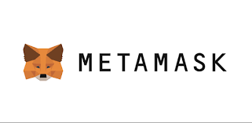
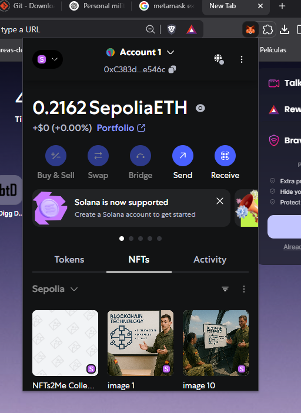
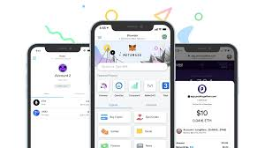
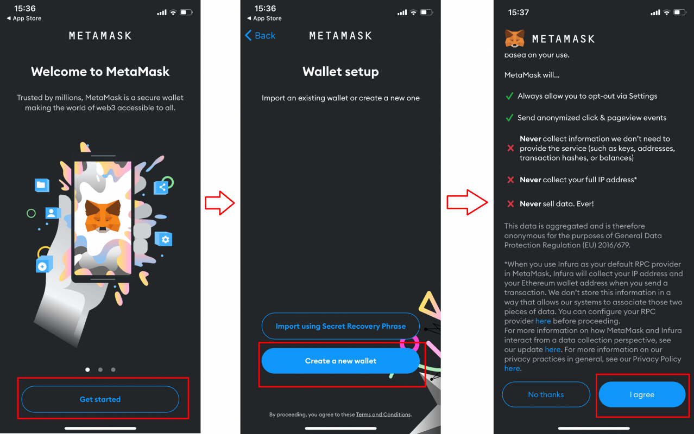
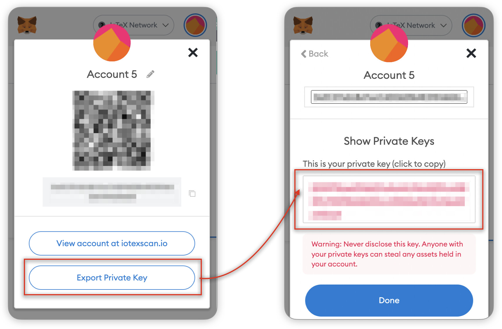
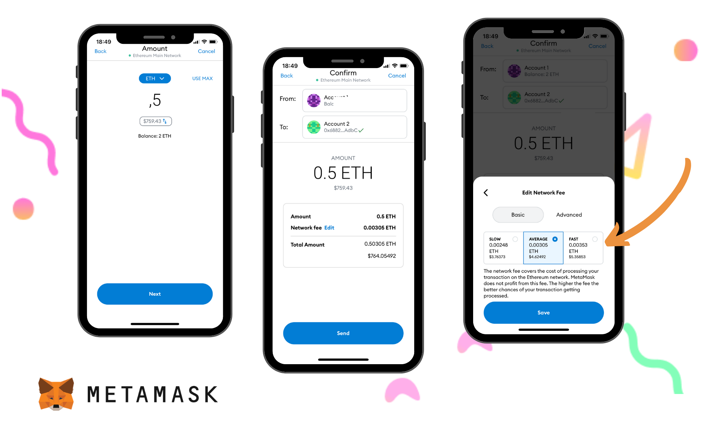
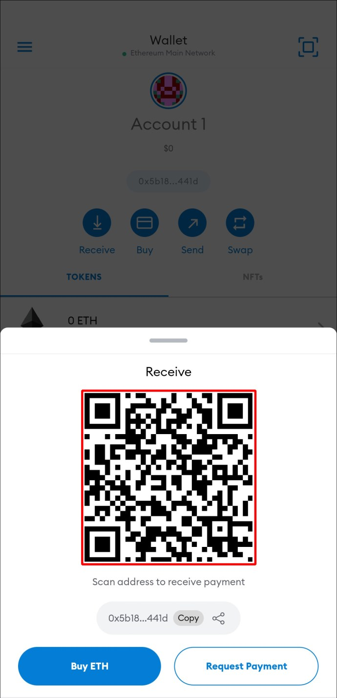
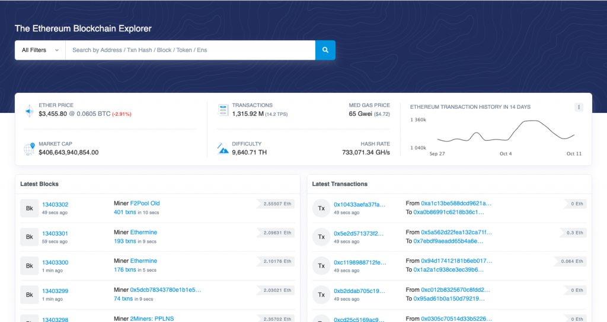
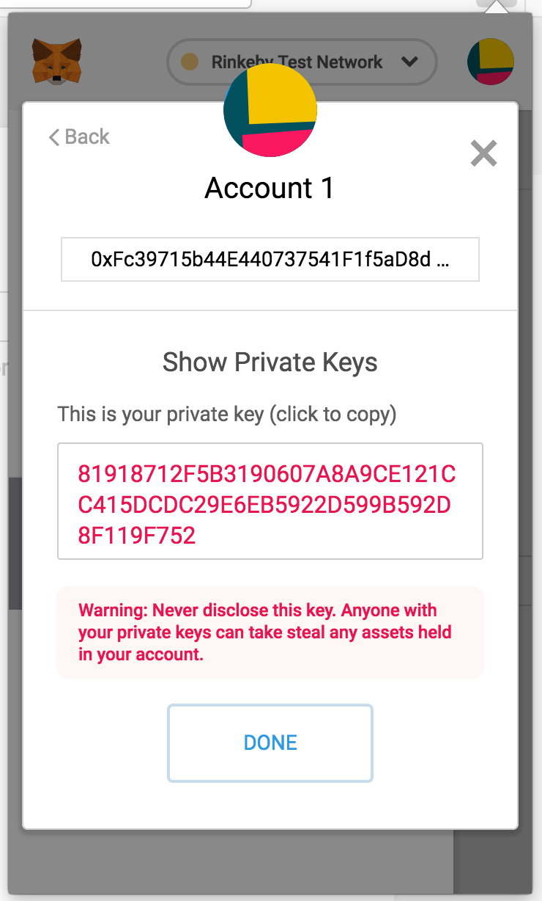
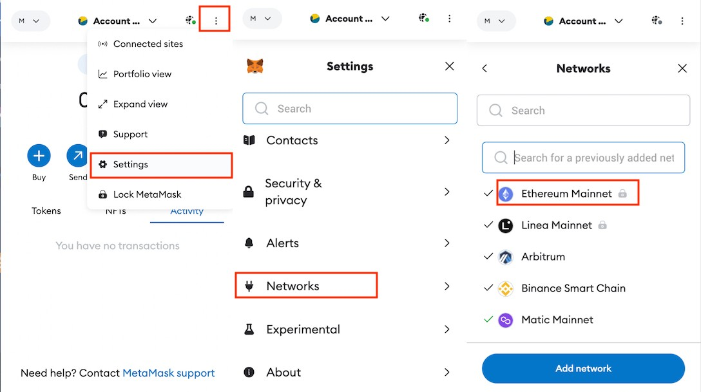

# Guía práctica: Primeros pasos con un Wallet Blockchain (MetaMask)

  

## 📋 Índice de contenidos

1. 📦 **Introducción a los Wallets**

   * ¿Qué es un wallet en blockchain?
   * Hot wallets vs Cold wallets
   * ¿Por qué usar MetaMask?

2. 🔧 **Instalación de MetaMask**

   * Requisitos previos
   * Instalación en navegador (Chrome, Firefox, Brave)
   * Instalación en móvil (Android, iOS)

3. 🆕 **Crear una cuenta en MetaMask**

   * Crear nueva billetera
   * Frase semilla: qué es y cómo guardarla
   * Configurar contraseña segura

4. 🔐 **Importar una cuenta existente**

   * Usando frase semilla
   * Usando clave privada

5. 📥📤 **Enviar y recibir transacciones**

   * Copiar tu dirección pública
   * Enviar fondos (ETH o testnet)
   * Recibir fondos
   * Uso de QR

6. 🧾 **Analizar una transacción**

   * Qué es un hash de transacción
   * Cómo consultar una transacción en Etherscan
   * Interpretar los datos básicos: estado, gas, fees...

7. 🔎 **Obtener claves públicas y privadas**

   * Dónde ver tu dirección pública
   * Cómo exportar la clave privada (⚠️ con advertencia de seguridad)
   * Buenas prácticas de seguridad

8. 🌐 **Cambiar de red en MetaMask**

   * ¿Qué son las redes en Ethereum?
   * Añadir la testnet de Sepolia
   * Cambiar entre redes (Mainnet/Testnet)

9.  🧠 **Ejercicios propuestos**

    * Reto 1: Recibir fondos desde un compañero
    * Reto 2: Enviar fondos a una dirección externa
    * Reto 3: Analizar una transacción en Etherscan

10. 🛡️ **Seguridad y recomendaciones**

    * Cómo identificar scams
    * Nunca compartas tu clave privada
    * Autenticación y almacenamiento seguro

---

## 📦 1. Introducción a los Wallets

### 🔐 ¿Qué es un wallet en blockchain?

Un **wallet** o monedero digital es una herramienta que te permite **almacenar, enviar y recibir criptomonedas**. No guarda directamente tus monedas, sino las **claves privadas** que te dan acceso a ellas en la blockchain.

> 🧠 **Importante:** Tener un wallet **es como ser tu propio banco**. Si pierdes tu clave privada o frase de recuperación, **nadie podrá ayudarte a recuperar tus fondos**.

---

### 🌡️ Hot wallets vs 🧊 Cold wallets

* **Hot wallets**: Están conectados a internet. Son cómodos pero menos seguros. Ej: MetaMask, Trust Wallet.
* **Cold wallets**: No están conectados a internet. Son más seguros, ideales para grandes cantidades. Ej: Ledger, Trezor.

---

### 🦊 ¿Por qué usar MetaMask?

* Es un **wallet gratuito**, muy utilizado y fácil de instalar.
* Funciona como **extensión de navegador y app móvil**.
* Permite conectarse a aplicaciones descentralizadas (**dApps**).
* Soporta múltiples redes, incluidas **testnets** como **Sepolia**, ideal para hacer pruebas sin usar dinero real.
* ✅ **Tú eres el único responsable de tus claves.** MetaMask **no guarda tu clave privada ni puede recuperar tu cuenta.**

> ⚠️ Si alguien accede a tu frase secreta o clave privada, podrá vaciar tu wallet sin dejar rastro.

---

## 🔧 2. Instalación de MetaMask

### ✅ Requisitos previos

Antes de empezar, asegúrate de tener:

* Un navegador moderno: **Chrome**, **Firefox** o **Brave**.
* Acceso a Google Play (Android) o App Store (iOS) si prefieres usar el móvil.
* Conexión a internet.

---

### 💻 Instalación en navegador

1. Entra en la web oficial:
   👉 [https://metamask.io](https://metamask.io)
2. Haz clic en **Download** y selecciona tu navegador.
3. Instala la extensión y fija el icono 🦊 en la barra de herramientas.

  

---

### 📱 Instalación en móvil

1. Abre Google Play o App Store.
2. Busca **MetaMask** y asegúrate de que el desarrollador sea *Consensys*.
3. Instala la app y abre MetaMask.

  

> 🧠 **Consejo:** Usa el mismo wallet tanto en navegador como en móvil si quieres practicar desde distintos dispositivos. Solo tendrás que importar tu cuenta.

---

Aquí tienes una descripción breve y clara para el apartado 3, ideal para tu manual en GitHub:

---

### 🆕 3. **Crear una cuenta en MetaMask**

Una vez instalada la extensión o app de MetaMask o ambas, toca crear tu billetera:

1. **Crear nueva billetera**: selecciona "Crear nueva wallet" y acepta las condiciones de uso. Vamos a crear una cuenta nueva, pero vamos a usar la testnet Sepolia para no gastar dinero real. Si quieres usar la red principal, te recomiendo que lo hagas más adelante cuando tengas más experiencia. 
   - Para elegir la red, haz clic en el icono de red en la parte superior izquierda y selecciona "Sepolia Test Network". Si no aparece, es posible que tengas que marcar "mostrar redes de prueba" (o show test networks, si lo tienes en inglés) en la configuración de MetaMask.
2. **Frase semilla (📜)**: MetaMask generará 12 palabras únicas. **Guárdalas en papel o en un lugar seguro offline**. Esta frase te permite recuperar tu cuenta. ⚠️ **¡Nunca la compartas!**
3. **Contraseña segura**: elige una contraseña robusta que protegerá tu wallet en el dispositivo actual. Si usas el movil, recomendamos usar el acceso biométrico (huella o reconocimiento facial) para mayor seguridad.

    

> 🛡️ **Consejo**: MetaMask no guarda tu frase semilla ni tu contraseña. Eres tú el responsable de su custodia.

📌 **Tarea obligatoria**

Una vez creada tu wallet en MetaMask, **envía al profesor tu dirección pública (clave pública)** junto con tu **nombre**. OJO!! no mandes **tu clave privada**. Si lo prefieres, puedes añadir también un *nickname* para identificarte en futuras prácticas y mantener tu anonimato.

> Esta información será necesaria para realizar pruebas y actividades en las siguientes sesiones. ¡No olvides este paso!

✉️ Puedes enviar un correo a: **[diego.martin.andres@uva.es](mailto:diego.martin.andres@uva.es)** indicando:

* Tu dirección pública (copiada desde MetaMask)
* Tu nombre real o tu apodo (nickname)

### 🔐 4. **Importar una cuenta existente**

Si ya tienes una billetera y quieres usarla en otro dispositivo o navegador, puedes importarla fácilmente:

1. **Usando frase semilla** (🌱): introduce las 12 palabras en el orden exacto en el que las guardaste. Es la forma más común y segura de recuperar tu cuenta.
2. **Usando clave privada**: también puedes introducir manualmente tu clave privada, aunque **no es la opción más recomendada** por motivos de seguridad. Y dificultad de uso, posibillidad de errores al escribirla.

    

> 📌 **Recuerda**: quien tenga tu frase semilla o tu clave privada puede controlar tu wallet. ¡Protégelas como si fueran las llaves de tu banco!

---

### 📥📤 **Enviar y recibir transacciones**

Una de las funciones principales de un wallet como MetaMask es permitirte **recibir** y **enviar fondos** (ETH o tokens compatibles):

1. **Copiar tu dirección pública**: es como tu "número de cuenta" en blockchain. Puedes compartirla con quien quiera enviarte fondos.
2. **Enviar fondos**: si tienes ETH (o tokens), selecciona "Enviar", pega la dirección del receptor o escanea su QR, introduce el importe y confirma.

    

3. **Recibir fondos**: ve a tu cuenta, copia tu dirección o comparte tu QR con el emisor.

    

4. **Uso de QR** (🔍): MetaMask genera automáticamente un código QR con tu dirección. Es muy útil para compartirla entre compañeros sin errores de copia.

---

### 📥 **Solicitar ETH de Sepolia**

Si acabas de empezar, probablemente **no tienes ETH** para hacer pruebas. Tienes dos soluciones:

1. ✅ **Pide al profesor** que te envíe una pequeña cantidad a tu wallet.
2. 🌍 **Faucets de prueba**: son páginas que te dan ETH falso (solo válido en testnet).

> Prueba este faucet oficial:

* 🌐 [Google Cloud Faucet Sepolia](https://cloud.google.com/application/web3/faucet/ethereum/sepolia)
* Introduce tu **wallet ID** (dirección pública) y pulsa **Receive 0.05 Sepolia ETH**
* ⚠️ Límite: *una vez al día por cuenta Google*

---

### 🧩 Reto

🔎 Busca en Internet otro **faucet para Sepolia** y consigue más ETH de prueba por tu cuenta.

> 💡 Consejo: comparte **los QRs de tu dirección pública** con tus compañeros para hacer pruebas rápidas de envío y recepción.

---

### 🧾 6. **Analizar una transacción**

Cuando haces una operación en blockchain (por ejemplo, enviar ETH), esta queda registrada públicamente. Vamos a aprender a consultarla:

1. **Qué es un hash de transacción** (🔢):
   Es un identificador único que representa una operación en la red. Es como el “resguardo” de una transferencia bancaria, pero público y verificable.

2. **Consultar en Etherscan** 🔍:
   Accede a [https://sepolia.etherscan.io](https://sepolia.etherscan.io) (para la testnet Sepolia).
   Puedes buscar:

   * La dirección de un **monedero** (wallet) → verás todas sus transacciones.

   * Un **hash de transacción** → verás los detalles de esa operación concreta.

   > 🧠 **Ojo**: una *dirección de wallet* y una *transacción* no son lo mismo. Cada una tiene su propio identificador.

3. **Interpretar los datos**:

   * **Estado**: si la transacción se ha completado con éxito (`Success`) o ha fallado.
   * **Gas usado y fees**: cuánto costó la operación (aunque en Sepolia no es dinero real, simula el funcionamiento real).
   * **Bloque**: en qué bloque quedó registrada.

    

> 🧩 **Explora**: busca la dirección pública de tu wallet en Sepolia Etherscan y analiza tus propias transacciones. ¿Cuántas has hecho? ¿Han sido exitosas? ¿Cuánto gas han consumido?

---

### 🔎 **Obtener claves públicas y privadas**

Tu wallet en MetaMask tiene **dos claves importantes**:

1. **Dirección pública (clave pública)** 🟢
   Es la que puedes compartir con cualquiera. Es como tu número de cuenta.
   La puedes ver fácilmente desde la pantalla principal de MetaMask (empieza por `0x...`).

   > También puedes **buscar esa dirección en Etherscan** para ver su actividad:
   > [https://sepolia.etherscan.io](https://sepolia.etherscan.io)

2. **Clave privada** (⚠️ solo para ti)
   Puedes exportarla desde MetaMask entrando en los **ajustes de la cuenta**.
   Para verla, tendrás que introducir tu contraseña.

   ⚠️ **Advertencia importante**:
   Si alguien tiene tu **clave privada**, puede robar todo lo que tengas en tu wallet. No la compartas **jamás** y guárdala **fuera del ordenador** (por ejemplo, escrita en papel).

3. **Buenas prácticas de seguridad** 🛡️

   * Nunca compartas tu clave privada ni la subas a internet.
   * Guarda tu frase semilla en papel, no en el móvil.
   * Usa contraseñas fuertes y activa biometría si usas MetaMask en el móvil.
   * Para practicar, usa siempre **redes de prueba** (como Sepolia), no la red principal.

    

> 💡 **Recuerda**: una **dirección de wallet** representa una cuenta, y **cada transacción** es una operación concreta que tiene un identificador (hash) distinto. Puedes explorar ambos en Etherscan para entender cómo funciona blockchain por dentro.

---

### 🌐 8. **Cambiar de red en MetaMask**

En Ethereum existen varias **redes**. Algunas son reales (como la *Mainnet*) y otras son de prueba (como *Sepolia*). MetaMask te permite cambiar fácilmente entre ellas.

1. **¿Qué son las redes en Ethereum?**
   Cada red es como un “universo paralelo” dentro de Ethereum.

   * **Mainnet**: la red principal, donde los ETH y tokens tienen valor real.
   * **Testnets**: redes de pruebas como **Sepolia**, ideales para aprender sin gastar dinero real.

2. **Añadir la testnet de Sepolia** 🧪
   Haz clic en el icono de red (parte superior de MetaMask) →
   Si no ves Sepolia, ve a **Configuración > Avanzado** y activa la opción **“Mostrar redes de prueba”** (*Show test networks*).

3. **Cambiar entre redes** 🔁
   Puedes cambiar de red fácilmente desde el selector de red en la parte superior.
   ¡Ojo! Cada red tiene su propio saldo, transacciones y contratos.

    

> 📊 Usa [Sepolia Etherscan](https://sepolia.etherscan.io) para explorar tu wallet, ver tus transacciones o analizar otras direcciones.
> Recuerda: **una wallet es un identificador**, pero **cada transacción** tiene su propio hash. Son cosas distintas que puedes consultar por separado.

---

### 🧠 **Ejercicios propuestos**

¡Es hora de poner en práctica lo aprendido! Estos retos te ayudarán a familiarizarte con el uso real de MetaMask y la exploración de transacciones en la blockchain.

---

#### 🧩 **Reto 1: Recibir fondos desde un compañero**

Comparte tu **dirección pública** (o mejor aún, tu **QR**) con otro compañero cercano y pídele que te envíe algo de ETH en la red de pruebas **Sepolia**.

> Recuerda: tu dirección pública empieza por `0x...` y es como tu número de cuenta.

---

#### 🧩 **Reto 2: Enviar fondos a una dirección externa**

Haz una transferencia de prueba a la dirección de otro compañero que se encuentre cerca.

* Abre MetaMask, haz clic en **Enviar**, introduce su dirección (o escanea su QR), elige la cantidad y confirma.

---

#### 🧩 **Reto 3: Analizar una transacción en Etherscan**

Copia el **hash** de una transacción que hayas realizado y búscalo en [Sepolia Etherscan](https://sepolia.etherscan.io).
Observa los siguientes datos:

* Estado (success / failed)
* Gas utilizado
* Dirección de origen y destino
* Fecha y número de bloque

    

> 🔍 **Recuerda**:
>
> * **Una wallet** es un identificador de cuenta (puedes buscarla en Etherscan para ver todo su historial).
> * **Una transacción** es una acción concreta y tiene un identificador (hash) distinto.
>   ¡Saber diferenciar ambas cosas es clave para entender cómo funciona Ethereum!

---

### 🛡️ 10. **Seguridad y recomendaciones**

Trabajar con wallets en blockchain conlleva responsabilidad. Aquí tienes algunos consejos esenciales para mantener tu cuenta segura:

1. **Cómo identificar scams (estafas)** ❌

   * Desconfía de webs o apps que te pidan tu **frase semilla** o **clave privada**.
   * No firmes transacciones si no entiendes lo que hacen.
   * Si algo parece demasiado bueno para ser verdad… probablemente lo sea.

---

2. **Nunca compartas tu clave privada** 🔒
   Esa clave permite controlar todos tus fondos.

   * MetaMask **no puede recuperarla** si la pierdes.
   * Guarda la frase semilla y la clave privada **fuera del ordenador**, en un papel o en un lugar seguro.

---

3. **Autenticación y almacenamiento seguro**

   * Usa contraseñas fuertes (no repitas la misma de otros servicios).
   * En el móvil, activa el acceso biométrico (huella o rostro).
   * No guardes capturas de tu clave ni frase semilla en la galería o en la nube.

---

> 🧠 **Tip útil**: Puedes usar [Etherscan](https://sepolia.etherscan.io) para auditar tu wallet:
> ¿Han salido fondos sin que lo recuerdes? ¿Hay transacciones sospechosas?
> Aprender a leer el historial de tu wallet es una herramienta clave para **detectar actividades anómalas**.

> 🔍 Recuerda siempre:
>
> * **Tu dirección pública** es como tu número de cuenta: la puedes compartir.
> * **Tu clave privada o frase semilla** son tu firma digital: **¡no la compartas nunca!**
